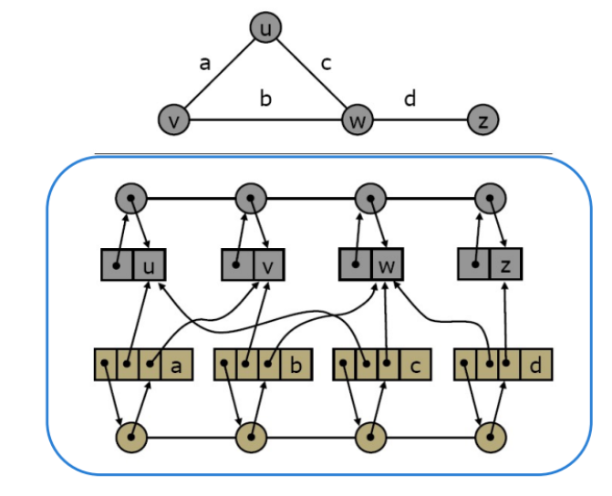

<div align="center">
<table>
    <theader>
        <tr>
            <td></td>
            <th>
                <span style="font-weight:bold;">UNIVERSIDAD NACIONAL DE SAN AGUSTIN</span><br />
                <span style="font-weight:bold;">FACULTAD DE INGENIERÍA DE PRODUCCIÓN Y SERVICIOS</span><br />
                <span style="font-weight:bold;">DEPARTAMENTO ACADÉMICO DE INGENIERÍA DE SISTEMAS E INFORMÁTICA</span><br />
                <span style="font-weight:bold;">ESCUELA PROFESIONAL DE INGENIERÍA DE SISTEMAS</span>
            </th>
            <td></td>
        </tr>
    </theader>
    <tbody>
        <tr><td colspan="3"><span style="font-weight:bold;">Formato</span>: Informe de Práctica de Laboratorio</td></tr>
        <tr><td><span style="font-weight:bold;">Aprobación</span>:  2022/03/01</td><td><span style="font-weight:bold;">Código</span>: GUIA-PRLD-001</td><td><span style="font-weight:bold;">Página</span>: 1</td></tr>
    </tbody>
</table>
</div>

<div align="center">
<span style="font-weight:bold;">INFORME DE LABORATORIO</span><br />
</div>

<table>
<theader>
<tr><th colspan="6">INFORMACIÓN BÁSICA</th></tr>
</theader>
<tbody>
<tr><td>ASIGNATURA:</td><td colspan="5">Estructura de Datos y Algoritmos</td></tr>
<tr><td>TÍTULO DE LA PRÁCTICA:</td><td colspan="5">Grafos</td></tr>
<tr>
<td>NÚMERO DE PRÁCTICA:</td><td>03</td><td>AÑO LECTIVO:</td><td>2022 A</td><td>NRO. SEMESTRE:</td><td>III</td>
</tr>
<tr>
<td>FECHA INICIO::</td><td>16-May-2022</td><td>FECHA FIN:</td><td>20-May-2022</td><td>DURACIÓN:</td><td>02 horas</td>
</tr>
<tr><td colspan="6">RECURSOS:
    <ul>
        <li>Weiss M., Data Structures & Problem Solving Using Java, 2010, Addison-Wesley.</li>
        <li>Escuela de Pedagogía en Educación Matemática, Marcelino Álvarez, et.al., http://repobib.ubiobio.cl/jspui/bitstream/123456789/1953/3/Alvarez_Nunez_Marcelino.pdf</li>
         <li>http://www.oia.unsam.edu.ar/wp-content/uploads/2017/11/dijkstra-prim.pdf</li>
    </ul>
</td>
</<tr>
<tr><td colspan="6">Integrantes:
<ul>
<li>Vladimir Arturo Sulla Quispe - vsullaq@unsa.edu.pe</li>
</ul>
</td>
</<tr>
<tr><td colspan="6">DOCENTES:
<ul>
<li>Richart Smith Escobedo Quispe - rescobedoq@unsa.edu.pe</li>
</ul>
</td>
</<tr>
</tdbody>
</table>

# SOLUCION Y RESULTADOS

## I SOLUCION DE EJERCICIOS/PROBLEMAS


## Ejercicio 1
. Crear un repositorio en GitHub, donde incluyan la resolucion de los ejercicios 
propuestos y el informe.

## Ejercicio 2
. Implementar el codigo de Grafo cuya representacion sea realizada mediante 
LISTA DE ADYACENCIA. (3 puntos)
Siguiendo la implementacion



Tenemos los atributos 
```java
//Un arreglo que almacena los verticces con su valor y pocicion en el arreglo
    private ArrayList<Vertice> vertices;
//Un arreglo que almacena las aristas que guardan la referencia al los vertices de destino
// y origen, ademas del valor de la arista y la pocicion 
    private ArrayList<Edge> edges;
```

Y para el ingreso de datos
#### Ingresar vertices
```java
    public void insertVertex(V o) {
        if(o == null)
            throw new NullPointerException();
    //El vertice se añade sin problemas al final del arraylist
        vertices.add(new Vertice(o, vertices.size()));
        list.add(new Item(vertices.get(vertices.size()-1),null));
    }
```
#### Ingresar aristas
```java
    public void insertEdge(V v, V w, E o) {
        if (v == null || w == null || o == null)
            throw new NullPointerException();
        //En el caso del ingreso de las arista se busca en el arreglo de vertices
        //el vertice origen
        for (int i = 0; i < vertices.size(); i++) {
            if (vertices.get(i).element.equals(v)) {
                edges.add(new Edge(o, vertices.get(i), null, edges.size()));
                break;
            }
        }
        // Y luego se busca el vertice de destino
        for (int i = 0; i < vertices.size(); i++) {
            if (vertices.get(i).element.equals(w)) {
                edges.get(edges.size()-1).verticeDestino = vertices.get(i);
                break;
            }
        }
    }
```
Una vez que tenemos estos metodos se crea un metodo para obtener la lista de adyacencia
```java
    public LinkedList getAdyacenceList() {
        //La lista de adyacencia es una lista enlazada que guarda listas enlazadas
        LinkedList<LinkedList<Vertice>> list = new LinkedList<LinkedList<Vertice>>();
        LinkedList<Vertice> tmp;
        //Entonces se itera sobre todos los vertices
        for (Vertice vertice : vertices) {
            tmp = new LinkedList<Vertice>();
            //El vertice se agrega a la lista principal
            tmp.add(vertice);
            //Se busca en cada arista si hay conexion con los vertices
            for (Edge e : edges) {
                if (e.verticeOrigen.equals(tmp.get(0))) {
                    tmp.add(e.verticeDestino);
                }
            }
            //Se guarda el vertice conectado
            list.add(tmp);
        }
        //Se devuelve la lista
        return list;
    }
```
## Ejercicio 3
Implementar BSF, DFS y Dijkstra con sus respectivos casos de prueba. (5 puntos)

## Ejercicio 4
Solucionar el siguiente ejercicio: (5 puntos)
El grafo de palabras se define de la siguiente manera: cada vértice es una palabra 
en el idioma Inglés y dos palabras son adyacentes si difieren exactamente en una 
posición. Por ejemplo, las cords y los corps son adyacentes, mientras que los 
corps y crops no lo son.
    a) Dibuje el grafo definido por las siguientes palabras: words cords corps coops
    crops drops drips grips gripe grape graph
  


    b) Mostrar la lista de adyacencia del grafo.    
    

## Ejercicio 5
Realizar un metodo en la clase Grafo. Este metodo permitira saber si un grafo esta 
incluido en otro. Los parametros de entrada son 2 grafos y la salida del metodo es 
true si hay inclusion y false el caso contrario. (4 puntos)

Para hallar si un grafo esta dentro de otro vamos a comparar aristas para ello sobreescribimos el metodo equals
```java
        public boolean equals(Object obj) {
            Edge other = (Edge) obj;
            //Aqui comparamos todo excepto la pocicion ya que no la necesitamos
            if(arista.equals(other)&&verticeDestino.equals(other)&&verticeOrigen.equals(other))
                return true;
            return false;
        }
```
Entonces podemos evaluar si las aristas de b estan dentro de a
```java
    public static boolean graphInsideGraph(Grafo a, Grafo b) {
        //Comprobamos 
        if(a.edges.containsAll(b.edges)) {
            return true;
        }
        return false;

    }

```

## II SOLUCION DEL CUESTIONARIO
- ¿Cuantas variantes del algoritmo de Dijkstra hay y cuál es la diferencia entre 
ellas? (1 puntos)

  - Algorimo de Prim 
  - Algorimo de Boruvka
  - Algoritmo de Borrador Inverso
  
- Invetigue sobre los ALGORITMOS DE CAMINOS MINIMOS e indique, ¿Qué
similitudes encuentra, qué diferencias, en qué casos utilizar y porque? (2 puntos)  
Los algoritmos de camino minimo consisten en encontrar el camino mas corto de un vertice a otro
algunos ejemplos de estos son:  

  - Algoritmo de Dijkstra Que halla el camino mas corto de un vertice hasta todos los otros vertices  
  - Algoritmo de bellman-Ford Que halla el camino si la ponderacion de las aristas es negativa  
  - Algoritmo de Busqueda A* Usa la heuristica para hallar el camino mas corto
  - Algoritmo de Floyd Warshall Halla el camino mas corto entre todos los vertices
  - Algoritmo de Jhonson Resuelve el problema y hasta puede ser mas rapido de floyd wharshall
  - Algoritmo de Viterbi Usa el problema del camino estocastico con un peso probabilistico  
- Los algoritmos de camino corto pueden usarse para:
  - Hallar el camino mas corto entre dos ubicaciones en el mapa
  - Busqueda en general
## III CONCLUSIONES

# RETROALIMENTACION GENERAL


# REFERENCIAS Y BIBLIOGRAFIA
```
https://es.wikipedia.org/wiki/Problema_del_camino_m%C3%A1s_corto
```